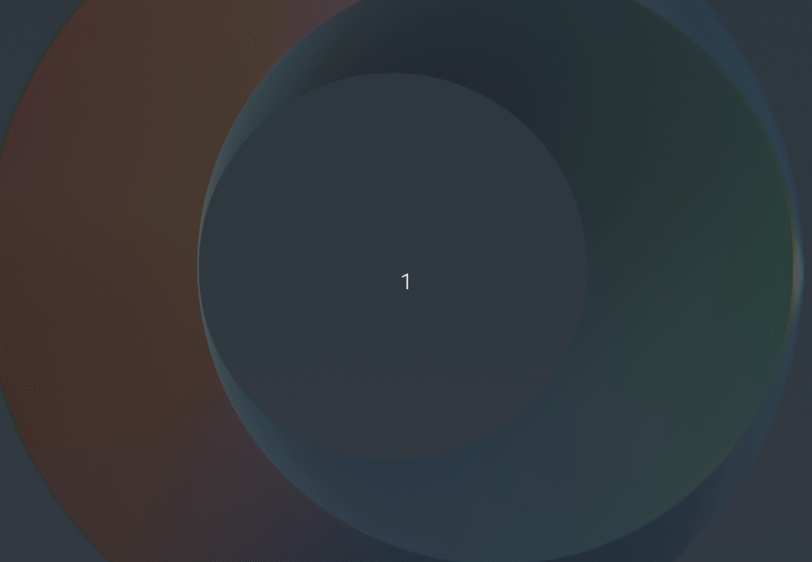

# Terminal Profile Setup (zsh)



## Notes

> How to dump current terminal profiles.
> Backup before changing anything is always a good idea isn't it?

```bash
dconf dump /org/gnome/terminal/legacy/profiles:/ > gnome-terminal-profiles.dconf
```

## Prerequisites

```bash
# Update your software repositories.
sudo apt-get update
sudo apt-get upgrade

# Install Git.
sudo apt-get install -y git

# Install Vim.
sudo apt-get install -y vim
```

## Installation

### Powerline and RobotoMono fonts

```bash
./install_powerline.sh
```

### ZSH, OhMyZSH

```bash
./install_terminal.sh
```

### Install plug-ins (you can `git pull` to update them later)

```bash
(cd ~/.oh-my-zsh/custom/plugins && git clone https://github.com/zsh-users/zsh-syntax-highlighting)
(cd ~/.oh-my-zsh/custom/plugins && git clone https://github.com/zsh-users/zsh-autosuggestions)
```

### Profile (plugins, theme, font and color)

This script will install two zsh plugins that I like to use: [auto-complete](https://github.com/zsh-users/zsh-autosuggestions) and [color highlighting](https://github.com/zsh-users/zsh-syntax-highlighting). This script will also set default shell to zsh, during the installation you will be asked to enter your root password or sudo password. And you may need to logout and login again to see the changes.

```bash
./install_profile.sh
```

> You can also change the font to any of the other [Powerline Patched Fonts](https://github.com/powerline/fonts) instead of RobotoMono.

### Display device information: [neofetch](https://github.com/dylanaraps/neofetch)

```bash
sudo apt-get install neofetch

# add alias to .zshrc
echo "alias mydevice='neofetch --ascii_colors 6 7 --colors 2 2 2 2'" >> ~/.zshrc
source ~/.zshrc

mydevice
```

### GIF recorder

[Peek](https://github.com/phw/peek)
